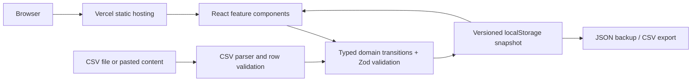
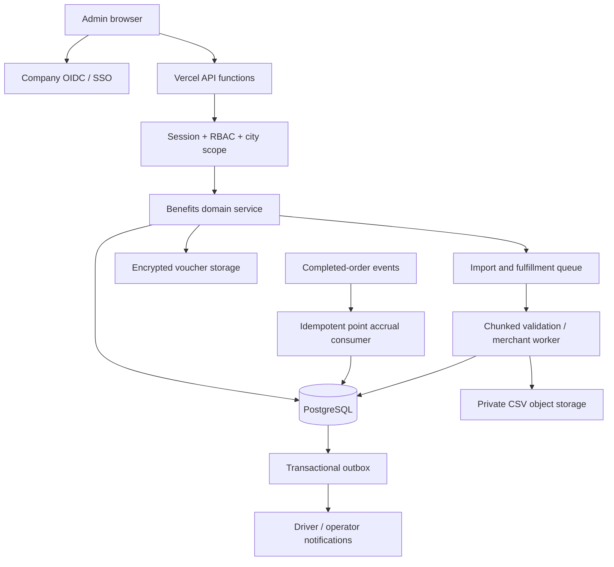

# AhaBenefits system design

## Implemented architecture

React + Vite renders the supplied admin design. Feature modules own their forms and UI state; reusable primitives own dialogs, fields, status pills and pagination. The domain layer performs validation and returns a new state without mutating its input. A commit reads the latest stored snapshot, runs the transition, writes it, then updates React. A failed storage write leaves the visible state unchanged and reports an error. Cross-tab storage events refresh other open copies.

This is a browser application, with no server API or credentials. localStorage is origin-scoped, user-editable and neither an authentication boundary nor an audit-grade store. Multiple simultaneous tab commits can overwrite one another. Each device/origin is independent. Data survives reloads but not browser storage deletion. Code imports are bounded to 2 MB / 10,000 rows and 20,000 codes total to keep browser storage and rendering manageable.

## Current entities

| Entity | Key and essential fields | Relationships |
|---|---|---|
| Gift | SKU, name, category, type, source, price, expiry, status, eligible cities, limit/period, physical stock | One-to-many codes, transactions, activities, batches |
| Code | Canonical code, SKU, expiry, available/redeemed, batch ID | Belongs to gift and import batch |
| Driver | Driver ID, city, remaining points | One-to-many transactions |
| Transaction | ID, SKU, driver, timestamp, city, immutable point price, optional sample code | Gift and driver |
| Import batch | ID, SKU, source, filename, validation counts, actor, time | Imported codes |
| Activity | ID, SKU, action, detail, actor, time | Gift |
| Multiplier | Current value, actor, timestamp | History and approval requests |
| Approval | Request ID, proposed/previous values, reason, requester, status, reviewer/note/time | Multiplier history |

Dates are ISO strings internally, with ICT display and calendar-period calculations. The initial data comes from the reference HTML, but actual sample codes are generated to match inventory counts. Only explicit historical transactions from the fuel gift are retained; other SKUs do not inherit unrelated mock data.

## Business invariants

- SKU uniqueness, code uniqueness across gifts and batches, integer prices/stock, strict dates and at least one eligible city.
- Codes stay in the inventory after redemption, preventing reimport and reuse. Expired codes are excluded from availability.
- Imports preserve gift visibility and create inventory/batch/activity data in one snapshot.
- Multipliers above 2.50 remain pending until independent review. A newer multiplier change supersedes older pending work.
- Redemption validates availability and eligibility before changing balances. The price at redemption is stored permanently.
- Gifts are hidden rather than deleted, preserving references and history.
- Exports neutralize spreadsheet formula prefixes. React renders untrusted text as text rather than HTML.

## Proposed shared production architecture — not deployed

Use company identity and server-side sessions. Resolve roles and city grants on the server for every request. Roles: Viewer for reads, Admin for catalog/import/config changes, Head of Ops for independent high-multiplier approval. Approval requesters must never review their own requests. Store secrets and merchant keys only on the server; imported redeemable codes require private encrypted storage and restricted disclosure.

### Suggested API contracts

| Method / route | Purpose and guarantees |
|---|---|
| GET /api/gifts | Filter, city-scope, sort, cursor paginate and return inventory counts |
| POST /api/gifts | Create validated unique SKU; audit actor from session |
| PATCH /api/gifts/:sku | Edit allowed fields using version/If-Match for concurrent updates |
| POST /api/gifts/:sku/stock-adjustments | Append stock movement with reason and idempotency key |
| POST /api/imports | Create signed private upload session and import job |
| GET /api/imports/:id | Progress, counts, preview, rejected-row report |
| POST /api/imports/:id/commit | Commit validated staged codes under unique constraints |
| GET /api/gifts/:sku/transactions | Cursor-paginated transaction ledger and export job |
| POST /api/redemptions | Authenticated eligible driver, idempotency key, atomic stock/points transaction |
| POST /api/multiplier-requests | Validate proposal and create approval or direct effective event |
| POST /api/multiplier-requests/:id/review | Independent authorized review with optimistic version check |
| GET /api/audit-events | Append-only audit query, permission and city scoped |

### PostgreSQL model

Use `gifts`, `gift_cities`, `voucher_codes`, `stock_movements`, `drivers`, `point_ledger`, `redemptions`, `import_batches`, `import_rows`, `multiplier_versions`, `multiplier_requests`, `audit_events` and `outbox_events` tables. Unique constraints on SKU, normalized code digest and idempotency keys prevent duplicate entities/actions. Foreign keys link records; CHECK constraints enforce nonnegative inventory and valid numeric bounds. Index gifts on searchable keys/status, codes on `(gift_id, status, expires_at)`, redemptions on `(driver_id, gift_id, created_at DESC)`, audit on `(entity_id, created_at DESC)`.

### Redemption transaction

1. Authenticate the driver; use server time and trusted city assignment.
2. Check idempotency key and return an existing result when retried.
3. Lock the driver balance and a driver/gift/period counter in consistent order. Validate balance and calendar limit under the locks.
4. Revalidate gift status, eligibility, price and expiry. Lock an available code with earliest expiry (`FOR UPDATE SKIP LOCKED`) or decrement physical stock conditionally.
5. Insert redemption, debit the append-only point ledger, update balance/limit counters, mark code consumed and append audit/outbox records in one database transaction.
6. Commit before delivering the voucher or invoking merchants. Process delivery from the outbox with retry and deduplication. Failed delivery must not produce a second debit; compensations require an explicit reversal entry.

### Imports and accrual

Production 500 MB uploads require direct private object uploads, background streaming parsing, staged rows, chunk progress and restartable jobs. Do not load a 500 MB file into an API request or the browser demo parser. Commit must enforce code uniqueness in the database even when preview looked valid.

Completed-order events use the multiplier effective at order completion, integer point arithmetic with a documented rounding policy, an order/event idempotency key and immutable ledger entries. Clarify late-arriving events and corrections with operations before enabling real accrual.

### Rollout and decisions still required

Choose company identity/SSO, database region and data retention, approver group, merchant/code-vault integration, global-vs-city stock allocation, point accrual rounding, cancellation/refund handling, physical fulfillment and import scale. Create a staging environment, migrate the schema, integrate identity, run concurrency/security tests and a limited pilot before real driver traffic.

Production observability should track import rejection/failure rates, stock depletion, redemption latency, double-spend conflicts, balance reconciliation, approval age and delivery retries. Use structured request IDs, append-only audit records, alerting and tested database restores.
